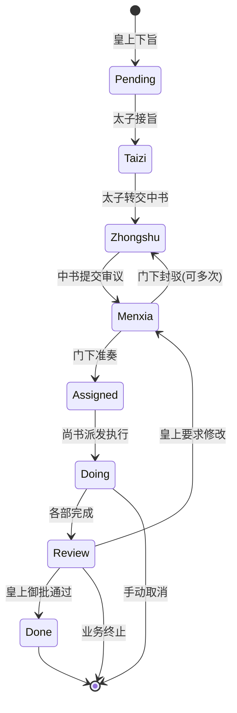

# Task distribution and transfer system for three provinces and six departments · Business and technical structure

> This document explains in detail how the "Three Provinces and Six Departments" project, from **business system design** to **code implementation details**, completely handles the task distribution and flow of complex multi-Agent collaboration. This is an **institutionalized AI multi-Agent framework** rather than a traditional free discussion collaboration system.

**Document overview**

```
━━━━━━━━━━━━━━━━━━━━━━━━━━━━━━ ━━━━━━━━━━━━━━━━━━━━━━━━━━━━━━━
Business layer: Imperial Governance Model
├─ Separation of powers and checks and balances: Emperor → Prince → Zhongshu → Menxia → Shangshu → Six Books
├─ System constraints: no skipping, status strictly progressive, must be reviewed by subordinates
└─ Quality assurance: capable of rejection, real-time observability, emergency intervention
━━━━━━━━━━━━━━━━━━━━━━━━━━━━━━ ━━━━━━━━━━━━━━━━━━━━━━━━━━━━━━━
Technical layer: OpenClaw Multi-Agent Orchestration (Multi-Agent Orchestration)
├─ State machine: 9 states (Pending → Taizi → Zhongshu → Menxia → Assigned → Doing/Next → Review → Done/Cancelled)
├─ Data fusion: flow_log + progress_log + session JSONL → unified activity stream
├─Permission matrix: strict subagent call permission control
└─ Scheduling layer: automatic dispatch, timeout retry, stalled upgrade, automatic rollback
━━━━━━━━━━━━━━━━━━━━━━━━━━━━━━ ━━━━━━━━━━━━━━━━━━━━━━━━━━━━━━━
Observation layer: React dashboard + real-time API (Dashboard + Real-time Analytics)
├─ Task dashboard: 10 view panels (all/by status/by department/by priority, etc.)
├─ Activity flow: 59 mixed activity records/task (thinking process, tool invocation, state transfer)
└─ Online status: Agent real-time node detection + heartbeat wake-up mechanism
━━━━━━━━━━━━━━━━━━━━━━━━━━━━━━ ━━━━━━━━━━━━━━━━━━━━━━━━━━━━━━━
```

---

## 📚 Part 1: Business Architecture

### 1.1 Imperial system: the design philosophy of decentralization and checks and balances

#### Core Concept

Traditional multi-Agent frameworks (such as CrewAI, AutoGen) adopt the **"free collaboration" mode**:
- Agent independently selects collaboration partners
- The framework only provides communication channels
- Quality control completely relies on Agent intelligence
- **Problem**: It is easy for agents to create false data for each other, duplicate work, and the quality of solutions is not guaranteed.

**Three provinces and six ministries** adopt the **"institutionalized collaboration" model**, imitating the ancient imperial bureaucracy:

```
emperor
(User)
│
↓
Taizi
[Sorting Officer, General Responsible for Message Access]
├─Identification: Is this a decree or just idle chatter?
├─ Execution: Reply directly to chat || Create task → Transfer to Zhongshu
└─ Permission: can only call Zhongshu Province
│
↓
Zhongshu
[Planning Officer, Chief Responsible for Plan Drafting]
├─ Analyze needs after receiving orders
├─ Break down into subtasks (todos)
├─ Invoke the Ministry of Menxia for review OR the Ministry of Secretariat for consultation
└─ Permissions: Can only call Menxia + Shangshu
│
↓
Menxia
[Reviewer, Quality Assurance Person]
├─ Review the Zhongshu plan (feasibility, completeness, risks)
├─Accept or reject (including modification suggestions)
├─ If rejected → Return to Zhongshu for revision → Re-examine (up to 3 rounds)
└─Permissions: Can only call Shangshu + callback Zhongshu
│
(✅ Accurate performance)
│
↓
Shangshu
[Distribution officer, executive commander]
├─ Receive the accurate plan
├─Analyze which department to distribute to
├─ Call the six departments (rituals/households/soldiers/criminals/workers/officials) to execute
├─ Monitor the progress of each department → Summarize the results
└─Permissions: Only six parts can be called (cannot transfer Zhongshu beyond the authority)
│
├─ Libu - Documentation Officer
├─Hubu - Data Analysis Officer
├─ Bingbu - Code Implementation Officer
├─ Xingbu - Test Examiner
├─ Ministry of Industry (Gongbu) - Infrastructure Officer
└─ Libu_hr - Human Resources Officer
│
(Each department is executed in parallel)
↓
Shangshu Province·Summary
├─ Collect six results
├─ Status changes to Review
├─ Call back to Zhongshu Sheng and report to the Emperor
│
↓
Zhongshu Province·Echo
├─ Summarize phenomena, conclusions, and suggestions
├─ Status changes to Done
└─ Reply to Feishu message to the Emperor
```

#### Four major guarantees of the system

| Guarantee mechanism | Implementation details | Protection effect |
|---------|---------|---------|
| **Institutional review** | The province must review all Zhongshu plans and cannot be skipped | Prevent Agent from executing randomly and ensure the feasibility of the plan |
| **Separation of powers and checks and balances** | Authority matrix: Strict definition of who can transfer whom | Prevent abuse of power (such as the minister's overstepping of authority to transfer the middle book reform plan) |
| **Fully Observable** | Task dashboard 10 panels + 59 activities/tasks | See where the task is stuck, who is working, and what the working status is in real time |
| **Real-time intervention** | One-click stop/cancel/resume/advance in the dashboard | Emergency situations (such as finding that the Agent is going in the wrong direction) can be corrected immediately |

---

### 1.2 Complete task transfer process

#### Process diagram



#### Specific critical path

**✅Ideal path** (no blockage, 4-5 days to complete)

```
DAY 1:
10:00 - The Emperor Feishu: "Write a complete automated testing plan for three provinces and six departments"
The prince accepted the order. state = Taizi, org = Prince
Automatically dispatch taizi agent → handle this request
  
10:30 - Prince sorting is completed. Determined as "work intention" (not chatting)
Build task JJC-20260228-E2E
flow_log record: "Emperor → Prince: Decree"
state: Taizi → Zhongshu, org: Prince → Zhongshu Province
Automatically dispatch zhongshu agent

DAY 2:
09:00 - Zhongshu Province receives the order. Start planning
Report progress: "Analyze test requirements and dismantle them into three layers: unit/integration/E2E"
progress_log record: "Zhongshu Sheng Zhang San: sub-requirements"
          
15:00 - Zhongshu Province completes the plan
todos snapshot: demand analysis✅, solution design✅, to be reviewed🔄
flow_log record: "Zhongshu Province → Menxia Province: Plan submitted for review"
state: Zhongshu → Menxia, ​​org: Zhongshu Province → Menxia Province
Automatically dispatch menxia agent

DAY 3:
09:00 - The province begins deliberations
Progress Report: "Now review the plan for completeness and risks"
          
14:00 - The review of the Menxia Province is completed
Judgment: "The solution is feasible, but the test of the _infer_agent_id_from_runtime function is missing"
Behavior:✅ Accurate (with modification suggestions)
flow_log record: "Menxia Province → Shangshu Province: ✅ The performance was approved (5 suggestions)"
state: Menxia → Assigned, org: Menxia Province → Shangshu Province
OPTIONAL: Zhongshu Province received suggestions and took the initiative to optimize the plan.
Automatically dispatch shangshu agent

DAY 4:
10:00 - Shangshu Sheng received the report
Analysis: "This test plan should be sent to the Ministry of Industry + the Ministry of Punishment + the Ministry of Rites to complete it together"
flow_log record: "Shangshu Province → Sixth Department: dispatch and execution (cooperation of soldiers and officials)"
state: Assigned → Doing, org: Shangshu Province → Ministry of War + Ministry of Punishment + Ministry of Rites
Automatically dispatch three agents bingbu/xingbu/libu (in parallel)

DAY 4-5:
(Each department is executed in parallel)
- Bingbu: Implement pytest + unittest testing framework
- Xingbu (xingbu): Write tests to cover all key functions
- Libu: Organize test documents and use case descriptions
  
Real-time report (hourly progress):
- Ministry of War: "✅ 16 unit tests implemented"
- Ministry of Justice: "🔄 Writing integration tests (completed on 8/12)"
- Ministry of Rites: "Wait until the Ministry of War is completed before writing a report."

DAY 5:
14:00 - All parts completed
state: Doing → Review, org: Ministry of War → Ministry of Education
Summary from Shangshu Province: "All tests have been completed, and the pass rate is 98.5%"
Transfer back to Zhongshu Province
          
15:00 - Zhongshu Province responds to the Emperor
state: Review → Done
Template reply to Feishu, including final result link and summary
```

**❌ Frustration Path** (including rejection and retry, 6-7 days)

```
DAY 2 Same as above

DAY 3 [rejection scene]:
14:00 - The review of the Menxia Province is completed
Judgment: "The plan is incomplete and lacks performance testing + stress testing"
Behavior: 🚫 Block
review_round += 1
flow_log record: "Menxia Province → Zhongshu Province: 🚫 Failed (need to supplement performance testing)"
state: Menxia → Zhongshu # Return to Zhongshu for modification
Automatically dispatch zhongshu agent (replanning)

DAY 3-4：
16:00 - Zhongshu Province receives the rejection notice (wakes up the agent)
Analyze improvement suggestions and supplement performance testing plans
progress: "Performance testing requirements have been integrated, and the correction plan is as follows..."
flow_log record: "Zhongshu Province → Menxia Province: Revised plan (2nd round of review)"
state: Zhongshu → Menxia
Automatically dispatch menxia agent

18:00 - Menxia Province reconsideration
Judgment: "✅ Passed this time"
flow_log record: "Menxia Province → Shangshu Province: ✅ Passed (2nd round)"
state: Menxia → Assigned → Doing
The follow-up is the same as the ideal path...

DAY 7: All completed (1-2 days later than ideal path)
```

---

### 1.3 Task Specification and Business Contract

#### Task Schema field description

```json
{
  "id": "JJC-20260228-E2E",          // 任务全局唯一ID (JJC-日期-序号)
  "title": "为三省六部编写完整自动化测试方案",
  "official": "中书令",              // 负责官职
  "org": "中书省",                   // 当前负责部门
  "state": "Assigned",               // 当前状态（见 _STATE_FLOW）
  
  // ──── 质量与约束 ────
  "priority": "normal",              // 优先级：critical/high/normal/low
  "block": "无",                     // 当前阻滞原因（如"等待工部反馈"）
  "reviewRound": 2,                  // 门下审议第几轮
  "_prev_state": "Menxia",           // 若被 stop，记录之前状态用于 resume
  
  // ──── 业务产出 ────
  "output": "",                      // 最终任务成果（URL/文件路径/总结）
  "ac": "",                          // Acceptance Criteria（验收标准）
  "priority": "normal",
  
  // ──── 流转记录 ────
  "flow_log": [
    {
      "at": "2026-02-28T10:00:00Z",
      "from": "皇上",
      "to": "太子",
      "remark": "下旨：为三省六部编写完整自动化测试方案"
    },
    {
      "at": "2026-02-28T10:30:00Z",
      "from": "太子",
      "to": "中书省",
      "remark": "分拣→传旨"
    },
    {
      "at": "2026-02-28T15:00:00Z",
      "from": "中书省",
      "to": "门下省",
      "remark": "规划方案提交审议"
    },
    {
      "at": "2026-03-01T09:00:00Z",
      "from": "门下省",
      "to": "中书省",
      "remark": "🚫 封驳：需补充性能测试"
    },
    {
      "at": "2026-03-01T15:00:00Z",
      "from": "中书省",
      "to": "门下省",
      "remark": "修订方案（第2轮审议）"
    },
    {
      "at": "2026-03-01T20:00:00Z",
      "from": "门下省",
      "to": "尚书省",
      "remark": "✅ 准奏通过（第2轮，5条建议已采纳）"
    }
  ],
  
  // ──── Agent 实时汇报 ────
  "progress_log": [
    {
      "at": "2026-02-28T10:35:00Z",
      "agent": "zhongshu",              // 汇报agent
      "agentLabel": "中书省",
      "text": "已接旨。分析测试需求，拟定三层测试方案...",
      "state": "Zhongshu",              // 汇报时的状态快照
      "org": "中书省",
      "tokens": 4500,                   // 资源消耗
      "cost": 0.0045,
      "elapsed": 120,
      "todos": [                        // 待办任务快照
        {"id": "1", "title": "需求分析", "status": "completed"},
        {"id": "2", "title": "方案设计", "status": "in-progress"},
        {"id": "3", "title": "await审议", "status": "not-started"}
      ]
    },
    // ... 更多 progress_log 条目 ...
  ],
  
  // ──── 调度元数据 ────
  "_scheduler": {
    "enabled": true,
    "stallThresholdSec": 180,         // 停滞超过180秒自动升级
    "maxRetry": 1,                    // 自动重试最多1次
    "retryCount": 0,
    "escalationLevel": 0,             // 0=无升级 1=门下协调 2=尚书协调
    "lastProgressAt": "2026-03-01T20:00:00Z",
    "stallSince": null,               // 何时开始停滞
    "lastDispatchStatus": "success",  // queued|success|failed|timeout|error
    "snapshot": {
      "state": "Assigned",
      "org": "尚书省",
      "note": "review-before-approve"
    }
  },
  
  // ──── 生命周期 ────
  "archived": false,                 // 是否归档
  "now": "门下省准奏，移交尚书省派发",  // 当前实时状态描述
  "updatedAt": "2026-03-01T20:00:00Z"
}
```

#### Business Contract

| Contract | Meaning | Consequences of breach |
|------|------|---------|
| **Not allowed to skip levels** | The prince can only transfer the middle secretary, the middle secretary can only transfer the subordinates/changshu, and the six departments cannot be called externally | Over-authorized calls are rejected and the system automatically intercepts them |
| **Status progresses in one direction** | Pending → Taizi → Zhongshu → ... → Done, cannot skip or go back | You can only return to the previous step through review_action(reject) |
| **Must be reviewed by the subordinates** | All plans proposed by the Zhongshu must be reviewed by the subordinates and cannot be skipped | The Zhongshu cannot directly transfer to the Minister, and the subordinates must enter |
| **No changes once Done** | The task cannot be modified after it enters the Done/Cancelled state | If you need to modify it, you need to create a new task or cancel and rebuild |
| **task_id uniqueness** | JJC-date-serial number is globally unique, the same task will not be created repeatedly on the same day | Kanban anti-duplication, automatic deduplication |
| **Transparent resource consumption** | Every progress report must be reported tokens/cost/elapsed | Facilitate cost accounting and performance optimization |

---

## 🔧 Part 2: Technical Architecture

### 2.1 State machine and automatic dispatch

#### Complete definition of state transfer

```python
_STATE_FLOW = {
    'Pending':  ('Taizi',   '皇上',    '太子',    '待处理旨意转交太子分拣'),
    'Taizi':    ('Zhongshu','太子',    '中书省',  '太子分拣完毕，转中书省起草'),
    'Zhongshu': ('Menxia',  '中书省',  '门下省',  '中书省方案提交门下省审议'),
    'Menxia':   ('Assigned','门下省',  '尚书省',  '门下省准奏，转尚书省派发'),
    'Assigned': ('Doing',   '尚书省',  '六部',    '尚书省开始派发执行'),
    'Next':     ('Doing',   '尚书省',  '六部',    '待执行任务开始执行'),
    'Doing':    ('Review',  '六部',    '尚书省',  '各部完成，进入汇总'),
    'Review':   ('Done',    '尚书省',  '太子',    '全流程完成，回奏太子转报皇上'),
}
```

Each state is automatically associated with an Agent ID (see `_STATE_AGENT_MAP`):

```python
_STATE_AGENT_MAP = {
    'Taizi':    'taizi',
    'Zhongshu': 'zhongshu',
    'Menxia':   'menxia',
    'Assigned': 'shangshu',
    'Doing':    None,      # 从 org 推断（六部之一）
    'Next':     None,      # 从 org 推断
    'Review':   'shangshu',
    'Pending':  'zhongshu',
}
```

#### Automatic distribution process

When the task state transfers (through `handle_advance_state()` or approval), the background automatically executes dispatch:

```
1. State transfer triggers distribution
├─ Look up the table _STATE_AGENT_MAP to get the target agent_id
├─ If it is Doing/Next, look up the table _ORG_AGENT_MAP from task.org to infer the specific department agent
└─ If it cannot be inferred, skip dispatch (such as Done/Cancelled)

2. Construct and distribute messages (targeted to prompt Agent to work immediately)
├─ taizi: "📜 The emperor’s decree needs you to handle..."
├─ zhongshu: "📜 The decree has been sent to Zhongshu Province, please draft a plan..."
├─ menxia: "📋 Zhongshu Provincial Plan is submitted for review..."
├─ shangshu: "📮 The Ministry of Menxia has approved the report, please dispatch it for execution..."
└─ Part 6: "📌 Please handle the task..."

3. Background asynchronous dispatch (non-blocking)
├─ spawn daemon thread
├─ Tag _scheduler.lastDispatchStatus = 'queued'
├─ Check if the Gateway process is open
├─ Run openclaw agent --agent {id} -m "{msg}" --deliver --timeout 300
├─ Retry up to 2 times (failure interval 5 seconds back off)
├─ Update _scheduler status and error messages
└─ flow_log records dispatch results

4. Distribution status transfer
├─ success: update immediately _scheduler.lastDispatchStatus = 'success'
├─ failed: Record the reason for failure. Agent will not block the kanban when it times out.
├─ timeout: Mark timeout to allow users to manually retry/upgrade
├─ gateway-offline: Gateway is not started, skip this distribution (you can try again later)
└─ error: abnormal situation, record stack for debugging

5. Processing of reaching the target Agent
├─ Agent receives notification from Feishu message
├─ Interact with Kanban (update status/record progress) through kanban_update.py
└─ After completing the work, it will be triggered again and dispatched to the next Agent.
```

---

### 2.2 Permission matrix and Subagent call

#### Permission definition (configured in openclaw.json)

```json
{
  "agents": [
    {
      "id": "taizi",
      "label": "太子",
      "allowAgents": ["zhongshu"]
    },
    {
      "id": "zhongshu",
      "label": "中书省",
      "allowAgents": ["menxia", "shangshu"]
    },
    {
      "id": "menxia",
      "label": "门下省",
      "allowAgents": ["shangshu", "zhongshu"]
    },
    {
      "id": "shangshu",
      "label": "尚书省",
      "allowAgents": ["libu", "hubu", "bingbu", "xingbu", "gongbu", "libu_hr"]
    },
    {
      "id": "libu",
      "label": "礼部",
      "allowAgents": []
    },
    // ... 其他六部同样 allowAgents = [] ...
  ]
}
```

#### Permission checking mechanism (code level)

In addition to `dispatch_for_state()`, there is a set of defensive permission checks:

```python
def can_dispatch_to(from_agent, to_agent):
    """检查 from_agent 是否有权调用 to_agent。"""
    cfg = read_json(DATA / 'agent_config.json', {})
    agents = cfg.get('agents', [])
    
    from_record = next((a for a in agents if a.get('id') == from_agent), None)
    if not from_record:
        return False, f'{from_agent} 不存在'
    
    allowed = from_record.get('allowAgents', [])
    if to_agent not in allowed:
        return False, f'{from_agent} 无权调用 {to_agent}（允许列表：{allowed}）'
    
    return True, 'OK'
```

#### Examples and handling of permission violations

| Scenario | Request | Result | Reason |
|------|------|------|------|
| **Normal** | Zhongshu Province → Menxia Province Review | ✅ Allow | Menxia is in Zhongshu’s allowAgents |
| **Violation** | Zhongshu Province → Shangshu Province Reform Plan | ❌ Reject | Zhongshu can only transfer the subordinates/ministers, but cannot manually change the ministerial work |
| **Violation** | Ministry of Industry → Shangshu Province "I'm done" | ✅ Change status | Through flow_log and progress_log (not cross-Agent call) |
| **Violation** | Shangshu Province → Zhongshu Province "Re-Change Plan" | ❌ Reject | Shangshu is not under the sect/Zhongshu's allowAgents |
| **Prevention and Control** | Agent forges distribution of other agents | ❌ Interception | API layer verification HTTP request source/signature |

---

### 2.3 Data fusion: progress_log + session JSONL

#### Phenomenon

When a task is executed, there are three layers of data sources:

```
1️⃣ flow_log
└─ Pure record state transfer (Zhongshu → Menxia)
└─ Data source: flow_log field of task JSON
└─ From: Agent reported through kanban_update.py flow command

2️⃣ progress_log
└─ Agent’s real-time work report (text progress, todos snapshot, resource consumption)
└─ Data source: progress_log field of task JSON
└─ From: Agent reported through kanban_update.py progress command
└─ Period: usually reported once every 30 minutes or key nodes

3️⃣ session JSONL (new!)
└─ Agent’s internal thinking process (thinking), tool invocation (tool_result), and conversation history (user)
└─ Data source: ~/.openclaw/agents/{agent_id}/sessions/*.jsonl
└─ From: OpenClaw framework automatically records, the agent does not need to actively operate
└─ Cycle: message level, the finest granularity
```

#### Problem Diagnosis

In the past, only flow_log + progress_log was used to show progress:
- ❌ Can’t see the Agent’s specific thinking process
- ❌ Can’t see the results of each tool call
- ❌ Cannot see the conversation history between Agents
- ❌ Agent exhibits "black box status"

For example: progress_log records "analyzing requirements", but users cannot see what is being analyzed.

#### Solution: Session JSONL Fusion

Add fusion logic in `get_task_activity()` (line 40):

```python
def get_task_activity(task_id):
    #...The previous code is the same as above...
    
    # ── Integrate Agent Session activities (thinking/tool_result/user)──
    session_entries = []
    
    # Active tasks: try to match exactly by task_id
    if state not in ('Done', 'Cancelled'):
        if agent_id:
            entries = get_agent_activity(
                agent_id, limit=30, task_id=task_id
            )
            session_entries.extend(entries)
        
        # Also obtained from related Agents
        for ra in related_agents:
            if ra != agent_id:
                entries = get_agent_activity(
                    ra, limit=20, task_id=task_id
                )
                session_entries.extend(entries)
    else:
        # Completed task: matching based on keywords
        title = task.get('title', '')
        keywords = _extract_keywords(title)
        if keywords:
            for ra in related_agents[:5]:
                entries = get_agent_activity_by_keywords(
                    ra, keywords, limit=15
                )
                session_entries.extend(entries)
    
    # Deduplication (avoid duplication through at+kind deduplication)
    existing_keys = {(a.get('at', ''), a.get('kind', '')) for a in activity}
    for se in session_entries:
        key = (se.get('at', ''), se.get('kind', ''))
        if key not in existing_keys:
            activity.append(se)
            existing_keys.add(key)
    
    # Reorder
    activity.sort(key=lambda x: x.get('at', ''))
    
    # Mark the data source when returning
    return {
        'activity': activity,
        'activitySource': 'progress+session',  # 新标记
        # ...other fields ...
    }
```

#### Session JSONL format parsing

The items extracted from JSONL are uniformly converted into Kanban activity items:

```python
def _parse_activity_entry(item):
    """将 session jsonl 的 message 统一解析成看板活动条目。"""
    msg = item.get('message', {})
    role = str(msg.get('role', '')).strip().lower()
    ts = item.get('timestamp', '')
    
    # 🧠 Assistant role - Agent thinking process
    if role == 'assistant':
        entry = {
            'at': ts,
            'kind': 'assistant',
            'text': '...主回复...',
            'thinking': '💭 Agent考虑到...',  # 内部思维链
            'tools': [
                {'name': 'bash', 'input_preview': 'cd /src && npm test'},
                {'name': 'file_read', 'input_preview': 'dashboard/server.py'},
            ]
        }
        return entry
    
    # 🔧 Tool Result - Tool call result
    if role in ('toolresult', 'tool_result'):
        entry = {
            'at': ts,
            'kind': 'tool_result',
            'tool': 'bash',
            'exitCode': 0,
            'output': '✓ All tests passed (123 tests)',
            'durationMs': 4500  # 执行时长
        }
        return entry
    
    # 👤 User - human feedback or conversation
    if role == 'user':
        entry = {
            'at': ts,
            'kind': 'user',
            'text': '请实现测试用例的异常处理'
        }
        return entry
```

#### Fusion activity flow structure

59 activity streams for a single task (JJC-20260228-E2E example):

```
kind count represents events
────────────────────────────────────────────
flow 10 state transfer chain (Pending→Taizi→Zhongshu→...)
progress 11 Agent work report ("analyzing", "completed")
todos 11 to-do task snapshot (each item when the progress is updated)
user 1 user feedback (such as "need to supplement performance testing")
assistant 10 Agent thinking process (💭 reasoning chain)
tool_result 16 Tool call record (bash running result, API call result)
────────────────────────────────────────────
Total 59 complete work tracks
```

When the board is displayed, users can:
- 📋 Look at the circulation chain to understand which stage the task is in
- 📝 Watch progress to understand what the Agent said in real time
- ✅ View todos to learn about task dismantling and completion progress
- 💭 See assistant/thinking to understand the Agent’s thinking process
- 🔧 See tool_result to understand the result of each tool call
- 👤 Look at user to see if there is manual intervention

---

### 2.4 Scheduling system: timeout retry, stalled upgrade, automatic rollback

#### Scheduling metadata structure

```python
_scheduler = {
    # Configuration parameters
    'enabled': True,
    'stallThresholdSec': 180,         # 停滞多久后自动升级（默认180秒）
    'maxRetry': 1,                    # 自动重试次数（0=不重试，1=重试1次）
    'autoRollback': True,             # 是否自动回滚到快照
    
    # Runtime status
    'retryCount': 0,                  # 当前已重试几次
    'escalationLevel': 0,             # 0=无升级 1=门下协调 2=尚书协调
    'stallSince': None,               # 何时开始停滞的时间戳
    'lastProgressAt': '2026-03-01T...',  # 最后一次获得进展的时间
    'lastEscalatedAt': '2026-03-01T...',
    'lastRetryAt': '2026-03-01T...',
    
    # Dispatch Tracking
    'lastDispatchStatus': 'success',  # queued|success|failed|timeout|gateway-offline|error
    'lastDispatchAgent': 'zhongshu',
    'lastDispatchTrigger': 'state-transition',
    'lastDispatchError': '',          # 错误堆栈（如有）
    
    # Snapshot (for automatic rollback)
    'snapshot': {
        'state': 'Assigned',
        'org': '尚书省',
        'now': '等待派发...',
        'savedAt': '2026-03-01T...',
        'note': 'scheduled-check'
    }
}
```

#### Scheduling algorithm

Run `handle_scheduler_scan(threshold_sec=180)` every 60 seconds:

```
FOR EACH task:
IF state in (Done, Canceled, Blocked):
SKIP # The final state is not processed
  
elapsed_since_progress = NOW - lastProgressAt
  
IF elapsed_since_progress < stallThreshold:
SKIP # There has been recent progress, no need to deal with it
  
# ── Stall processing logic ──
IF retryCount < maxRetry:
✅ Execute【Retry】
- increment retryCount
- dispatch_for_state(task, new_state, trigger='taizi-scan-retry')
- flow_log: "Stayed for 180 seconds, triggering automatic retry for the Nth time"
- NEXT task
  
IF escalationLevel < 2:
✅ Execute【Upgrade】
- nextLevel = escalationLevel + 1
- target_agent = menxia (if L=1) else shangshu (if L=2)
- wake_agent(target_agent, "💬 The task is stalled, please step in to coordinate and advance")
- flow_log: "Upgrade to {target_agent} coordination"
- NEXT task
  
IF escalationLevel >= 2 AND autoRollback:
✅ Execute [Automatic Rollback]
- restore task to snapshot.state
- retryCount = 0
- escalationLevel = 0
- dispatch_for_state(task, snapshot.state, trigger='taiji-auto-rollback')
- flow_log: "Continuous stagnation, automatic rollback to {snapshot.state}"
```

#### Example scenario

**Scenario: Zhongshu Province Agent process crashes and the task is stuck in Zhongshu**

```
T+0:
Zhongshu Province is planning a plan
lastProgressAt = T
dispatch status=success

T+30:
Agent process crashes unexpectedly (or becomes overloaded and unresponsive)
lastProgressAt still = T (no new progress)

T+60:
Scheduler_scan scanned it and found:
elapsed = 60 < 180, skip

T+180:
Scheduler_scan scanned it and found:
elapsed = 180 >= 180, trigger processing
  
✅ Phase 1: Try again
- retryCount: 0 → 1
- dispatch_for_state('JJC-20260228-E2E', 'Zhongshu', trigger='taizi-scan-retry')
- Distribute messages to Zhongshu Province (wake up the agent or restart it)
- flow_log: "Stayed for 180 seconds, automatically retry for the first time"

T+240:
Zhongshu Province Agent is restored (or restarted manually) and retry distribution is received.
Report progress: "Recovered, continue planning..."
lastProgressAt is updated to T+240
retryCount reset to 0
  
✓ Problem solving

T+360 (if still not recovered):
scheduler_scan scan again and find:
elapsed = 360 >= 180, retryCount already = 1
  
✅ Phase 2: Upgrade
- escalationLevel: 0 → 1
- wake_agent('menxia', "💬 Task JJC-20260228-E2E is stalled, there is no response from Zhongshu Province, please intervene")
- flow_log: "Upgrade to Menxia Province Coordination"
  
When the Menxia Province Agent is awakened, it can:
- Check whether Zhongshu Province is online
- If online, ask about progress
- If offline, emergency procedures may be initiated (such as being temporarily drafted by a subordinate)

T+540 (if still unresolved):
scheduler_scan scan again and find:
escalationLevel = 1, can also be upgraded to 2
  
✅ Phase 3: Upgrade again
- escalationLevel: 1 → 2
- wake_agent('shangshu', "💬 The task has been stalled for a long time. Neither Zhongshu Province nor Menxia Province can advance it. Shangshu Province please intervene and coordinate")
- flow_log: "Upgrade to Shangshu Provincial Coordination"

T+720 (if still unresolved):
scheduler_scan scan again and find:
escalationLevel = 2 (maximum), autoRollback = true
  
✅ Phase 4: Automatic rollback
- snapshot.state = 'Assigned' (previous stable state)
- task.state: Zhongshu → Assigned
- dispatch_for_state('JJC-20260228-E2E', 'Assigned', trigger='taizi-auto-rollback')
- flow_log: "Continuous stagnation, automatically rolled back to Assigned, and redistributed by Shangshu Sheng"
  
result:
- The Shangshu Province redistributed it to the six ministries for execution
- Zhongshu Province’s solution is retained in the previous snapshot version
- Users can see the rollback operation and decide whether to intervene
```

---

## 🎯 Part 3: Core API and CLI Tools

### 3.1 Task operation API endpoint

#### Task creation: `POST /api/create-task`

```
ask:
{
"title": "Written a complete automated test plan for three provinces and six departments",
"org": "Zhongshu Sheng", // optional, defaults to Prince
"official": "Zhongshu Ling", // optional
"priority": "normal",
"template_id": "test_plan", // optional
"params": {},
"target_dept": "Ministry of War + Ministry of Punishment" // Optional, send suggestions
}

response:
{
"ok": true,
"taskId": "JJC-20260228-001",
"message": "Decree JJC-20260228-001 has been issued and is being distributed to the prince"
}
```

#### Task activity flow: `GET /api/task-activity/{task_id}`

```
ask:
GET /api/task-activity/JJC-20260228-E2E

response:
{
"ok": true,
"taskId": "JJC-20260228-E2E",
"taskMeta": {
"title": "Written a complete automated test plan for three provinces and six departments",
"state": "Assigned",
"org": "Shang Shu Sheng",
"output": "",
"block": "none",
"priority": "normal"
},
"agent ID": "above",
"agentLabel": "Shang Shu Sheng",
  
//── Complete activity flow (59 examples)──
"activity": [
// flow_log (10 items)
{
"at": "2026-02-28T10:00:00Z",
"kind": "flow",
"from": "Your Majesty",
"to": "Prince",
"remark": "Declaration: Write a complete automated testing plan for three provinces and six departments"
},
// progress_log (11 items)
{
"at": "2026-02-28T10:35:00Z",
"kind": "progress",
"text": "Accepted the order. Analyze the test requirements and formulate a three-layer test plan...",
"Argentina": "Heat stroke",
"agentLabel": "Zhongshu Province",
"state": "Z sweet potato",
"org": "中书省",
"tokens": 4500,
"cost": 0.0045,
"elapsed": 120
},
// todos (11 items)
{
"at": "2026-02-28T15:00:00Z",
"kind": "todos",
"items": [
{"id": "1", "title": "Requirements Analysis", "status": "completed"},
{"id": "2", "title": "Project Design", "status": "in-progress"},
{"id": "3", "title": "await review", "status": "not-started"}
],
"Argentina": "Heat stroke",
"diff": {
"changed": [{"id": "2", "from": "not-started", "to": "in-progress"}],
"added": [],
"removed": []
}
},
// session activities (26 items in total)
// - assistant (10 items)
{
"at": "2026-02-28T14:23:00Z",
"kind": "assistant",
"text": "Based on requirements, I recommend using a three-tier testing architecture:\n1. Unit tests cover core functions\n2. Integration tests cover API endpoints\n3. E2E tests cover the complete process",
"thinking": "💭 Considering the complexity of the project, the interaction logic of seven Agents needs to be covered. The unit test should use pytest, and the integration test should use the HTTP test after server.py is started...",
"tools": [
{"name": "bash", "input_preview": "find . -name '*.py' -type f | wc -l"},
{"name": "file_read", "input_preview": "dashboard/server.py (first 100 lines)"}
]
},
// - tool_result (16 items)
{
"at": "2026-02-28T14:24:00Z",
"kind": "tool_result",
"tool": "bash",
"exitCode": 0,
"output": "83",
"durationMs": 450
}
],
  
"activitySource": "progress+session",
"related agents": ["Prince", "Heatstroke", "Menxia"],
"phaseDurations": [
{
"phase": "Prince",
"durationText": "30 minutes",
"ongoing": false
},
{
"phase": "中书省",
"durationText": "4 hours and 32 minutes",
"ongoing": false
},
{
"phase": "门下胜",
"durationText": "1 hour and 15 minutes",
"ongoing": false
},
{
"phase": "Shang Shu Sheng",
"durationText": "4 hours and 10 minutes",
"ongoing": true
}
],
"totalDuration": "10 hours and 27 minutes",
"todosSummary": {
"total": 3,
"completed": 2,
"inProgress": 1,
"notStarted": 0,
"percent": 67
},
"resourceSummary": {
"totalTokens": 18500,
"totalCost": 0.0187,
"totalElapsedSec": 480
}
}
```

#### State advancement: `POST /api/advance-state/{task_id}`

```
ask:
{
"comment": "It's clearly time to move forward with the mission."
}

response:
{
"ok": true,
"message": "JJC-20260228-E2E has been advanced to the next stage (Agent has been automatically dispatched)",
"old state": "Z sweet potato",
"newState": "Menxia",
"targetAgent": "menxia"
}
```

#### Approval operation: `POST /api/review-action/{task_id}`

```
Request (accurate):
{
"action": "approve",
"comment": "The solution is feasible and improvement suggestions have been adopted"
}

OR request (rejection):
{
"action": "reject",
"comment": "Supplementary performance testing is required, Nth round of review"
}

response:
{
"ok": true,
"message": "JJC-20260228-E2E has been played (Agent has been automatically dispatched)",
"state": "Assigned",
"reviewRound": 1
}
```

---

### 3.2 CLI tool: kanban_update.py

Agent interacts with the Kanban board through this tool, with a total of 7 commands:

#### Command 1: Create task (manual by Prince or Zhongshu)

```bash
python3 scripts/kanban_update.py create \
  JJC-20260228-E2E \
  "为三省六部编写完整自动化测试方案" \
  Zhongshu \
  中书省 \
  中书令

# Note: Usually there is no need to run it manually (the Kanban API is automatically triggered), unless debugging
```

#### Command 2: Update status

```bash
python3 scripts/kanban_update.py state \
  JJC-20260228-E2E \
  Menxia \
  "方案提交门下省审议"

# illustrate:
# - First parameter: task_id
# - Second parameter: new status (Pending/Taizi/Zhongshu/...)
# - The third parameter: optional, description information (will be recorded in the now field)
#
# Effect:
# - task.state = Menxia
# - task.org automatically infers "MenxiaSheng"
# - Trigger dispatch of menxia agent
# - flow_log record transfer
```

#### Command 3: Add transfer record

```bash
python3 scripts/kanban_update.py flow \
  JJC-20260228-E2E \
  "中书省" \
  "门下省" \
  "📋 方案提交审核，请审议"

# illustrate:
# - Parameter 1: task_id
# - Parameter 2: from_dept (who is reporting)
# - Parameter 3: to_dept (who to transfer to)
# - Parameter 4: remark (remarks, can include emoji)
#
# Note: only record flow_log, do not change task.state
# (Mostly used for detail transfer, such as coordination between departments)
```

#### Command 4: Real-time progress report (emphasis!)

```bash
python3 scripts/kanban_update.py progress \
  JJC-20260228-E2E \
  "已完成需求分析和方案初稿，现正征询工部意见" \
  "1.需求分析✅|2.方案设计✅|3.工部咨询🔄|4.待门下审议"

# illustrate:
# - Parameter 1: task_id
# - Parameter 2: Progress text description
# - Parameter 3: todos current snapshot (separate each item with |, supports emoji)
#
# Effect:
# - progress_log adds new entries:
# {
# "at": now_iso(),
# "agent": inferred_agent_id,
# "text": "The needs analysis and first draft of the plan have been completed, and the opinions of the Ministry of Industry are now being sought",
# "state": task.state,
# "org": task.org,
# "todos": [
# {"id": "1", "title": "Requirements Analysis", "status": "completed"},
# {"id": "2", "title": "Project Design", "status": "completed"},
# {"id": "3", "title": "Ministry of Industry Consulting", "status": "in-progress"},
# {"id": "4", "title": "To be reviewed", "status": "not-started"}
# ],
# "tokens": (automatically read from openclaw session data),
# "cost": (automatically calculated),
# "elapsed": (automatically calculated)
# }
#
# Kanban effect:
# - Render as active item on the fly
# - todos progress bar update (67% completed)
# - Accumulated display of resource consumption
```

#### Command 5: Task completed

```bash
python3 scripts/kanban_update.py done \
  JJC-20260228-E2E \
  "https://github.com/org/repo/tree/feature/auto-test" \
  "自动化测试方案已完成，涵盖单元/集成/E2E三层，通过率98.5%"

# illustrate:
# - Parameter 1: task_id
# - Parameter 2: output URL (can be a code repository, document link, etc.)
# - Parameter 3: Final summary
#
# Effect:
# - task.state = Done (advance from Review)
# - task.output = "https://..."
# - Automatically send Feishu message to the emperor (reported by the prince)
# - flow_log records the completed transfer
```

#### Command 6 & 7: Stop/Cancel Task

```bash
# Stop (can be resumed at any time)
python3 scripts/kanban_update.py stop \
  JJC-20260228-E2E \
  "等待工部反馈继续"

# illustrate:
# - task.state temporary storage (_prev_state)
# - task.block = "Waiting for feedback from the Ministry of Engineering to continue"
# - The board shows "⏸️ Stopped"
#
# recover:
python3 scripts/kanban_update.py resume \
  JJC-20260228-E2E \
  "工部已反馈，继续执行"
#
# - task.state is restored to _prev_state
# - redispatch agent

# Cancel (unrecoverable)
python3 scripts/kanban_update.py cancel \
  JJC-20260228-E2E \
  "业务需求变更，任务作废"
#
# - task.state = Canceled
# - flow_log records cancellation reasons
```

---

## 💡 Part 4: Benchmarking and Comparison

### The traditional approach of CrewAI / AutoGen vs the institutionalized approach of Three Provinces and Six Departments

| Dimensions | CrewAI | AutoGen | **Three provinces and six departments** |
|------|--------|---------|----------|
| **Collaboration mode** | Free discussion (Agent independently selects collaboration objects) | Panel + callback (Human-in-the-loop) | **Institutionalized collaboration (authority matrix + state machine)** |
| **Quality Assurance** | Rely on Agent intelligence (no review) | Human review (frequent interruptions) | **Automatic review (required review by the province) + Intervention possible** |
| **Permission Control** | ❌ None | ⚠️ Hard-coded | **✅ Configurable Permission Matrix** |
| **Observability** | Low (Agent message black box) | Medium (Human sees the conversation) | **Extremely high (59 activities/tasks)** |
| **Interventionability** | ❌ No (difficult to stop after running) | ✅ Yes (manual approval required) | **✅ Yes (one-click stop/cancel/advance)** |
| **Task Distribution** | Uncertain (Agent selects independently) | Confirmed (Human manual classification) | **Automatically determined (authority matrix + state machine)** |
| **Throughput** | 1 task 1Agent (serial discussion) | 1 task 1Team (requires manual management) | **Multiple tasks in parallel (six tasks executed simultaneously)** |
| **Failure recovery** | ❌ (restart) | ⚠️ (requires manual debugging) | **✅ (automatic retry 3 stages)** |
| **Cost Control** | Opaque (no cost upper limit) | Medium (Human can stop) | **Transparent (cost reported for each progress)** |

### Strictness of business contracts

**CrewAI's "gentle" approach**
```python
# Agent can freely choose the next step of work
if task_seems_done:
    # Agent decides whether to report to other Agents
    send_message_to_someone()  # 可能发错人，可能重复
```

**The "strict" approach of three provinces and six ministries**
```python
# The task status is strictly limited, and the next step is determined by the system
if task.state == 'Zhongshu' and agent_id == 'zhongshu':
    # Can only do what Zhongshu should do (drafting plan)
    deliver_plan_to_menxia()
    
    #State transfer can only be done through API and cannot be bypassed
    # Zhongshu cannot directly transfer to the Minister, it must be reviewed by the subordinates.
    
    # If you want to bypass the deliberation under the door
    try:
        dispatch_to(shangshu)  # ❌ 权限检查拦截
    except PermissionError:
        log.error(f'zhongshu 无权越权调用 shangshu')
```

---

## 🔍 Part 5: Failure Scenarios and Recovery Mechanism

### Scenario 1: Agent process crashes

```
Symptom: The task is stuck in a certain state and there is no new progress for 180 seconds.
Alarm: Prince dispatch system detects stagnation

Automatic processing flow:
T+0: crash
T+180: scan detects stall
✅ Phase 1: Automatic retry
- Send messages to the agent (wake up or restart)
- If the agent recovers, the process continues
  
T+360: If it is not restored yet
✅ Phase 2: Upgrade coordination
- Wake up the door-to-door agent
- Report: "No response from Zhongshu Province, please intervene"
- The subordinate may take over or act as an agent
  
T+540: If it is not restored yet
✅ Phase 3: Upgrade again
- Wake up Shangshu Province agent
- Report: "The task is completely stuck, please coordinate at the enterprise level"
  
T+720: If it is not restored yet
✅ Stage 4: Automatic rollback
-Restore to previous stable state
- Distributed to Shangshu Province for reprocessing
- User can see full rollback link
```

### Scenario 2: Agent does evil (forged data)

Suppose the `zhongshu` agent wants to cheat the system:

```python
# Try to forge the correct performance of Menxiasheng (change JSON directly)
task['flow_log'].append({
    'from': '门下省',      # ❌ 假冒身份
    'to': '尚书省',
    'remark': '✅ 准奏'
})

# System defense:
# 1. Permission verification: API layer checks the identity of the HTTP requester
# ├─ Requests from zhongshu agent cannot flow directly
# ├─ Must be recorded through flow_log and signature verification
# └─ Reject if the signature does not match
# 2. State machine verification: state transition is controlled
# ├─ Even if flow_log is tampered with, the state is still Zhongshu
# ├─ The next step can only be transferred by the gate-keeper system
# └─ zhongshu has no right to change the state by himself

# Result: ❌ Agent’s forgery is intercepted by the system
```

### Scenario 3: Business process violation (such as Zhongshu exceeding his authority and adjusting the Shangshu's reform plan)

```python
# Zhongshu Sheng wants to bypass the deliberation of the subordinates and directly consult the Shangshu Sheng
try:
    result = dispatch_to_agent('shangshu', '请帮我审查一下这个方案')
except PermissionError:
    # ❌ Permission matrix interception
    log.error('zhongshu 无权调用 shangshu (仅限: menxia, shangshu)')

# Menxia Sheng wants to upgrade to the Emperor
try:
    result = dispatch_to_agent('taizi', '我需要皇上的指示')
except PermissionError:
    # ❌ Permission matrix interception
    log.error('menxia 无权调用 taizi')
```

---

## 📊 Part 6: Monitoring and Observability

### Kanban’s 10 view panels

```
1. Full task list
└─ Summary view of all tasks (in reverse order of creation time)
└─ Quick filter: active/completed/rejected

2. Classification by status
├─ Pending
├─ Taizi (Prince sorting)
├─ Zhongshu (under planning in Zhongshu)
├─ Menxia (under review)
├─ Assigned (distributed by Shangshu)
├─ Doing (six parts in progress)
├─ Review (Shang Shu summary)
└─ Done/Cancelled

3. Classification by department
├─ Prince’s mission
├─ Zhongshu Provincial Mission
├─ Save tasks under the door
├─ Mission of Shangshu Province
├─ Six tasks (parallel view)
└─ Task assigned

4. Sort by priority
├─ 🔴 Critical
├─ 🟠 High
├─ 🟡Normal
└─ 🔵 Low (low quality)

5. Agent online status
├─ 🟢 Running (processing tasks)
├─ 🟡 On call (recently active, idle)
├─ ⚪ Idle (no activity for more than 10 minutes)
├─ 🔴 Offline (Gateway is not started)
└─ ❌ Not configured (workspace does not exist)

6. Task details panel
├─ Basic information (title, creator, priority)
├─ Complete activity flow (flow_log + progress_log + session)
├─Stage time consumption statistics (residence time of each Agent)
├─ Todos progress bar
└─ Resource consumption (tokens/cost/elapsed)

7. Monitoring of stalled tasks
├─ List all tasks that have exceeded the threshold and have not been advanced
├─ Show the pause duration
├─ Quick actions: Retry/Upgrade/Rollback

8. Approval work order pool
├─ List all tasks waiting for approval in Menxia
├─ Sort by length of stay
├─ One-touch accuracy/rejection

9. Today’s Overview
├─ Number of new tasks created today
├─Number of tasks completed today
├─ Average circulation time
├─ Activity frequency of each Agent

10. Historical reports
├─ Weekly report (output per capita, average cycle)
├─ Monthly report (department collaboration efficiency)
└─ Cost analysis (API call cost, Agent workload)
```

### Real-time API: Agent online detection

```
GET /api/agents-status

response:
{
"ok": true,
"gateway": {
"alive": true, // The process exists
"probe": true, // HTTP response is normal
"status": "🟢 Running"
},
"agents": [
{
"ID": "Prince",
"label": "Prince",
"status": "running", // running|idle|offline|unconfigured
"statusLabel": "🟢 Running",
"lastActive": "03-02 14:30", // Last active time
"lastActiveTs": 1708943400000,
"sessions": 42, //Number of active sessions
"hasWorkspace": true,
"processAlive": true
},
// ... other agents ...
]
}
```

---

## 🎓 Part 7: Usage examples and best practices

### Complete case: Create→Distribute→Execute→Complete

```bash
# ═════════════════════════════ ══════════════════════════════
# Step 1: The Emperor issues an edict (Feishu message or Kanban API)
# ═════════════════════════════ ══════════════════════════════

curl -X POST http://127.0.0.1:7891/api/create-task \
  -H "Content-Type: application/json" \
  -d '{
    "title": "编写三省六部协议文档",
    "priority": "high"
  }'

# Response: JJC-20260302-001 created
# Prince Agent received the notification: "📜 The Emperor's decree..."

# ═════════════════════════════ ══════════════════════════════
# Step 2: The prince receives the order and sorts it (Agent automatically)
# ═════════════════════════════ ══════════════════════════════

#Prince Agent's judgment: This is "work intention" (not chatting)
# Automatically run:
python3 scripts/kanban_update.py state \
  JJC-20260302-001 \
  Zhongshu \
  "分拣完毕，转中书省起草"

# Zhongshu Province Agent received the distribution notification

# ═════════════════════════════ ══════════════════════════════
# Step 3: Drafting the letter (Agent work)
# ═════════════════════════════ ══════════════════════════════

# Zhongshu Agent analyzes requirements and dismantles tasks

# First report (after 30 minutes):
python3 scripts/kanban_update.py progress \
  JJC-20260302-001 \
  "已完成需求分析，拟定三部分文档：概述|技术栈|使用指南" \
  "1.需求分析✅|2.文档规划✅|3.内容编写🔄|4.审查待完成"

# Kanban display:
# - Progress bar: 50% complete
# - Activity flow: add progress + todos entries
# - Consumption: 1200 tokens, $0.0012, 18 minutes

# Second report (in another 90 minutes):
python3 scripts/kanban_update.py progress \
  JJC-20260302-001 \
  "文档初稿已完成，现提交门下省审议" \
  "1.需求分析✅|2.文档规划✅|3.内容编写✅|4.待审查"

python3 scripts/kanban_update.py flow \
  JJC-20260302-001 \
  "中书省" \
  "门下省" \
  "提交审议"

python3 scripts/kanban_update.py state \
  JJC-20260302-001 \
  Menxia \
  "方案提交门下省审议"

# Men Xia Province Agent received the distribution notice and started deliberation.

# ═════════════════════════════ ══════════════════════════════
# Step 4: Deliberation under the sect (Agent work)
# ═════════════════════════════ ══════════════════════════════

# MenxiaAgent reviews document quality

# Review results (after 30 minutes):

# Scenario A: Accurate performance
python3 scripts/kanban_update.py state \
  JJC-20260302-001 \
  Assigned \
  "✅ 准奏，已采纳改进建议"

python3 scripts/kanban_update.py flow \
  JJC-20260302-001 \
  "门下省" \
  "尚书省" \
  "✅ 准奏：文档质量良好，建议补充代码示例"

# Shangshu Province Agent received the distribution

# Scenario B: Denial
python3 scripts/kanban_update.py state \
  JJC-20260302-001 \
  Zhongshu \
  "🚫 封驳：需补充协议规范部分"

python3 scripts/kanban_update.py flow \
  JJC-20260302-001 \
  "门下省" \
  "中书省" \
  "🚫 封驳：协议部分过于简略，需补充权限矩阵示例"

# Zhongshu Province Agent receives the awakening and re-modifies the plan
# (After 3 hours → resubmit for review)

# ═════════════════════════════ ══════════════════════════════
# Step 5: Distribution by Minister (Agent work)
# ═════════════════════════════ ══════════════════════════════

# Shangshu Province Agent analyzes who the document should be sent to:
# - Department of Rites: Document layout and formatting
# - Ministry of War: Supplementary code examples
# - Ministry of Industry: Deployment Documents

python3 scripts/kanban_update.py state \
  JJC-20260302-001 \
  Doing \
  "派发给礼部+兵部+工部三部并行执行"

python3 scripts/kanban_update.py flow \
  JJC-20260302-001 \
  "尚书省" \
  "六部" \
  "派发执行：礼部排版|兵部代码示例|工部基础设施部分"

# Six Agents received distribution respectively

# ═════════════════════════════ ══════════════════════════════
# Step 6: Six executions (parallel)
# ═════════════════════════════ ══════════════════════════════

# Etiquette Department Progress Report (20 minutes):
python3 scripts/kanban_update.py progress \
  JJC-20260302-001 \
  "已完成文档排版和目录调整，现待其他部门内容补充" \
  "1.排版✅|2.目录调整✅|3.等待代码示例|4.等待基础设施部分"

# Ministry of War progress report (40 minutes):
python3 scripts/kanban_update.py progress \
  JJC-20260302-001 \
  "已编写5个代码示例（权限检查、派发流程、session融合等），待集成到文档" \
  "1.分析需求✅|2.编码示例✅|3.集成文档🔄|4.测试验证"

# Ministry of Industry Progress Report (60 minutes):
python3 scripts/kanban_update.py progress \
  JJC-20260302-001 \
  "已编写Docker+K8s部署部分，Nginx配置和让证书更新文案完成" \
  "1.Docker编写✅|2.K8s配置✅|3.一键部署脚本🔄|4.部署文档待完成"

# ═════════════════════════════ ══════════════════════════════
# Step 7: Summary of Shangshu (Agent work)
# ═════════════════════════════ ══════════════════════════════

# After all departments have completed their reports, Shangshu Province will summarize all results

python3 scripts/kanban_update.py progress \
  JJC-20260302-001 \
  "全部部门已完成。汇总成果：\n- 文档已排版，包含9个章节\n- 15个代码示例已集成\n- 完整部署指南已编写\n通过率：100%" \
  "1.排版✅|2.代码示例✅|3.基础设施✅|4.汇总✅"

python3 scripts/kanban_update.py state \
  JJC-20260302-001 \
  Review \
  "所有部门完成，进入审查阶段"

# The emperor/prince receives the notice and reviews the final results

# ═════════════════════════════ ══════════════════════════════
# Step 8: Completion (final state)
# ═════════════════════════════ ══════════════════════════════

python3 scripts/kanban_update.py done \
  JJC-20260302-001 \
  "https://github.com/org/repo/docs/architecture.md" \
  "三省六部协议文档已完成，包含89页，5个阶段历时3天，总消耗成本$2.34"

# Kanban display:
# - Status: Done ✅
# - Total time taken: 3 days, 2 hours and 45 minutes
# - Complete activity stream: 79 activity records
# - Resource statistics: 87500 tokens, $2.34, 890 minutes of total working time

# ═════════════════════════════ ══════════════════════════════
# Query the final results
# ═════════════════════════════ ══════════════════════════════

curl http://127.0.0.1:7891/api/task-activity/JJC-20260302-001

# Response:
# {
# "taskMeta": {
# "state": "Done",
# "output": "https://github.com/org/repo/docs/architecture.md"
# },
# "activity": [79 complete circulation chains],
# "totalDuration": "3 days, 2 hours and 45 minutes",
# "resourceSummary": {
# "totalTokens": 87500,
# "totalCost": 2.34,
# "totalElapsedSec": 53700
# }
# }
```

---

## 📋 Summary

**Three Provinces and Six Ministries is an institutionalized AI multi-Agent system**, not a traditional "free discussion" framework. It passes:

1. **Business layer**: imitate the ancient imperial bureaucracy and establish an organizational structure with decentralized checks and balances.
2. **Technical layer**: state machine + permission matrix + automatic dispatch + scheduling retry to ensure the process is controllable
3. **Observation layer**: React dashboard + complete activity flow (59 items/task), grasp the overall situation in real time
4. **Intervention layer**: One-click stop/cancel/advance, and can immediately correct any anomalies encountered

**Core Value**: Use systems to ensure quality, use transparency to ensure confidence, and use automation to ensure efficiency.

Compared with the "freedom + manual management" of CrewAI/AutoGen, San Province and Six Ministries provides an **enterprise-level AI collaboration framework**.
