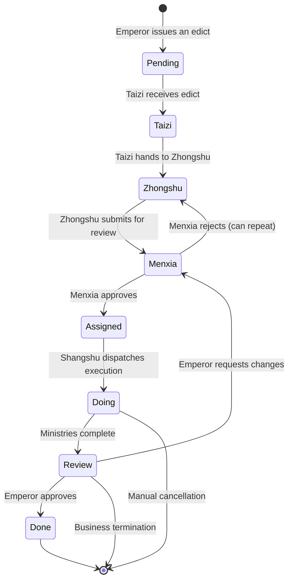

# Three Departments & Six Ministries Task Dispatch & Flow System · Business and Technical Architecture

> This document explains in detail how the “Three Departments & Six Ministries” project goes from **institutional/business design** to **code-level implementation details**, and how it handles task dispatch and lifecycle flow for complex multi-Agent collaboration. This is an **institutionalized AI multi-Agent framework**, not a traditional free-form discussion-based collaboration system.

**Document overview diagram**

```
━━━━━━━━━━━━━━━━━━━━━━━━━━━━━━━━━━━━━━━━━━━━━━━━━━━━━━━━━━━━━
Business Layer: Imperial Governance Model
  ├─ Checks & balances: Emperor → Taizi → Zhongshu → Menxia → Shangshu → Six Ministries
  ├─ Institutional constraints: no skipping levels, strict state progression, Menxia must review
  └─ Quality guarantees: can veto/reject and send back, fully observable, emergency intervention
━━━━━━━━━━━━━━━━━━━━━━━━━━━━━━━━━━━━━━━━━━━━━━━━━━━━━━━━━━━━━
Technical Layer: OpenClaw Multi-Agent Orchestration
  ├─ State machine: 9 states (Pending → Taizi → Zhongshu → Menxia → Assigned → Doing/Next → Review → Done/Cancelled)
  ├─ Data fusion: flow_log + progress_log + session JSONL → unified activity stream
  ├─ Permission matrix: strict controls over subagent invocation
  └─ Scheduling layer: auto-dispatch, timeout retries, stall escalation, auto-rollback
━━━━━━━━━━━━━━━━━━━━━━━━━━━━━━━━━━━━━━━━━━━━━━━━━━━━━━━━━━━━━
Observability Layer: React Dashboard + Real-time API (Dashboard + Real-time Analytics)
  ├─ Task Kanban: 10 view panels (all/by state/by department/by priority, etc.)
  ├─ Activity stream: ~59 mixed activity records per task (thinking, tool calls, state transitions)
  └─ Online status: real-time agent node detection + heartbeat wake-up mechanism
━━━━━━━━━━━━━━━━━━━━━━━━━━━━━━━━━━━━━━━━━━━━━━━━━━━━━━━━━━━━━
```

---

## 📚 Part 1: Business Architecture

### 1.1 Imperial Institution: the design philosophy of checks and balances

#### Core concepts

Traditional multi-Agent frameworks (such as CrewAI, AutoGen) use a **“free collaboration”** model:
- Agents autonomously pick collaborators
- The framework only provides communication channels
- Quality control depends entirely on agent intelligence
- **Problem**: agents can easily fabricate data, duplicate work, and there is no quality guarantee for plans/solutions

**Three Departments & Six Ministries** uses an **“institutionalized collaboration”** model, inspired by the ancient imperial bureaucracy:

```
              Emperor
              (User)
               │
               ↓
             Taizi (Crown Prince)
        [Triage officer, entrypoint owner]
      ├─ Identify: is this an edict (command) or casual chat?
      ├─ Execute: reply to chat directly || create a task → forward to Zhongshu
      └─ Permission: may only call Zhongshu
               │
               ↓
           Zhongshu (Secretariat)
      [Planning officer, primary drafter]
      ├─ Analyze requirements after receiving the edict
      ├─ Decompose into subtasks (todos)
      ├─ Request Menxia review OR consult Shangshu
      └─ Permission: may only call Menxia + Shangshu
               │
               ↓
           Menxia (Chancellery)
        [Review officer, quality owner]
      ├─ Review Zhongshu plan (feasibility, completeness, risks)
      ├─ Approve OR Reject (with modification suggestions)
      ├─ If rejected → return to Zhongshu to revise → re-review (up to 3 rounds)
      └─ Permission: may only call Shangshu + call back Zhongshu
               │
         (✅ Approved)
               │
               ↓
           Shangshu (Department of State Affairs)
        [Dispatch officer, execution commander]
      ├─ Receive the approved plan
      ├─ Decide which department should execute
      ├─ Call the Six Ministries (Rites/Revenue/War/Justice/Works/Personnel)
      ├─ Monitor each ministry’s progress → aggregate results
      └─ Permission: may only call the Six Ministries (cannot overstep to call Zhongshu)
               │
               ├─ Libu (Ministry of Rites)        - documentation officer
               ├─ Hubu (Ministry of Revenue)      - data analysis officer
               ├─ Bingbu (Ministry of War)        - code implementation officer
               ├─ Xingbu (Ministry of Justice)    - testing & review officer
               ├─ Gongbu (Ministry of Works)      - infrastructure officer
               └─ Libu_hr (Ministry of Personnel) - HR officer
               │
         (Ministries execute in parallel)
               ↓
           Shangshu · Aggregation
      ├─ Collect results from the ministries
      ├─ Transition state to Review
      ├─ Call back Zhongshu to report upward to the Emperor
               │
               ↓
           Zhongshu · Final report
      ├─ Summarize observations, conclusions, suggestions
      ├─ Transition state to Done
      └─ Reply to the Emperor via Feishu
```

#### Four guarantees provided by the institution

| Guarantee mechanism | Implementation detail | Protection effect |
|---|---|---|
| **Institutional review** | Menxia must review all Zhongshu plans; cannot be skipped | Prevents agents from executing arbitrarily; ensures the plan is feasible |
| **Checks & balances** | Permission matrix: who can call whom is strictly defined | Prevents abuse of power (e.g., Shangshu overstepping to Zhongshu to rewrite the plan) |
| **Full observability** | 10 dashboard panels + ~59 activities per task | See in real-time where the task is stuck, who is working, and current status |
| **Real-time intervention** | One-click stop/cancel/resume/advance inside the dashboard | Emergency correction when an agent goes off-track |

---

### 1.2 Full task lifecycle flow

#### Flow diagram



#### Concrete critical paths

**✅ Ideal path** (no blocking; completes in 4–5 days)

```
DAY 1:
  10:00 - Emperor on Feishu: "Write a full automated testing plan for Three Departments & Six Ministries"
          Taizi receives the edict. state = Taizi, org = Taizi
          Auto-dispatch taizi agent → handle this edict

  10:30 - Taizi finishes triage. Determines it is a "work edict" (not casual chat)
          Create task JJC-20260228-E2E
          flow_log: "Emperor → Taizi: edict issued"
          state: Taizi → Zhongshu, org: Taizi → Zhongshu
          Auto-dispatch zhongshu agent

DAY 2:
  09:00 - Zhongshu receives. Starts planning
          Progress: "Analyze test requirements; decompose into unit/integration/E2E layers"
          progress_log: "Zhongshu Zhang San: split requirements"

  15:00 - Zhongshu completes the proposal
          todos snapshot: requirements analysis✅, plan design✅, pending review🔄
          flow_log: "Zhongshu → Menxia: submit proposal for review"
          state: Zhongshu → Menxia, org: Zhongshu → Menxia
          Auto-dispatch menxia agent

DAY 3:
  09:00 - Menxia begins review
          Progress: "Now reviewing completeness and risk"

  14:00 - Menxia completes review
          Judgement: "Plan is feasible, but missing tests for _infer_agent_id_from_runtime"
          Action: ✅ Approve (with modification suggestions)
          flow_log: "Menxia → Shangshu: ✅ Approved (5 suggestions)"
          state: Menxia → Assigned, org: Menxia → Shangshu
          OPTIONAL: Zhongshu receives suggestions and proactively improves the plan
          Auto-dispatch shangshu agent

DAY 4:
  10:00 - Shangshu receives the approved plan
          Analysis: "This test plan should be assigned to Gongbu + Xingbu + Libu"
          flow_log: "Shangshu → Six Ministries: dispatch execution (ministry collaboration)"
          state: Assigned → Doing, org: Shangshu → Bingbu+Xingbu+Libu
          Auto-dispatch bingbu/xingbu/libu agents (parallel)

DAY 4-5:
  (All ministries execute in parallel)
  - Bingbu: implement pytest + unittest test frameworks
  - Xingbu: write tests covering all key functions
  - Libu: produce documentation and test-case descriptions

  Real-time progress (hourly):
  - Bingbu: "✅ Implemented 16 unit tests"
  - Xingbu: "🔄 Writing integration tests (8/12 completed)"
  - Libu: "Waiting for Bingbu to finish before writing report"

DAY 5:
  14:00 - Ministries finish
          state: Doing → Review, org: Bingbu → Shangshu
          Shangshu aggregates: "All tests completed; pass rate 98.5%"
          Handoff back to Zhongshu

  15:00 - Zhongshu reports back to the Emperor
          state: Review → Done
          Template reply to Feishu, including final links and summary
```

**❌ Setback path** (includes rejection and retry; 6–7 days)

```
DAY 2 same as above

DAY 3 [rejection scenario]:
  14:00 - Menxia completes review
          Judgement: "Plan is incomplete; missing performance tests + stress tests"
          Action: 🚫 Reject
          review_round += 1
          flow_log: "Menxia → Zhongshu: 🚫 Rejected (must add performance testing)"
          state: Menxia → Zhongshu  # return to Zhongshu for revision
          Auto-dispatch zhongshu agent (re-plan)

DAY 3-4:
  16:00 - Zhongshu receives the rejection notice (wake agent)
          Analyze improvement feedback; add performance testing plan
          progress: "Integrated performance testing; revised plan as follows..."
          flow_log: "Zhongshu → Menxia: revised plan (round 2 review)"
          state: Zhongshu → Menxia
          Auto-dispatch menxia agent

  18:00 - Menxia re-reviews
          Judgement: "✅ Approved this time"
          flow_log: "Menxia → Shangshu: ✅ Approved (round 2)"
          state: Menxia → Assigned → Doing
          Subsequent steps follow the ideal path...

DAY 7: Everything completes (1–2 days later than ideal)
```

---

### 1.3 Task specification & business contract

#### Task Schema field description

```json
{
  "id": "JJC-20260228-E2E",          // 任务全局唯一ID (JJC-日期-序号)
  "title": "为三省六部编写完整自动化测试方案",
  "official": "中书令",              // 负责官职
  "org": "中书省",                   // 当前负责部门
  "state": "Assigned",               // 当前状态（见 _STATE_FLOW）
  
  // ──── 质量与约束 ────
  "priority": "normal",              // 优先级：critical/high/normal/low
  "block": "无",                     // 当前阻滞原因（如"等待工部反馈"）
  "reviewRound": 2,                  // 门下审议第几轮
  "_prev_state": "Menxia",           // 若被 stop，记录之前状态用于 resume
  
  // ──── 业务产出 ────
  "output": "",                      // 最终任务成果（URL/文件路径/总结）
  "ac": "",                          // Acceptance Criteria（验收标准）
  "priority": "normal",
  
  // ──── 流转记录 ────
  "flow_log": [
    {
      "at": "2026-02-28T10:00:00Z",
      "from": "皇上",
      "to": "太子",
      "remark": "下旨：为三省六部编写完整自动化测试方案"
    },
    {
      "at": "2026-02-28T10:30:00Z",
      "from": "太子",
      "to": "中书省",
      "remark": "分拣→传旨"
    },
    {
      "at": "2026-02-28T15:00:00Z",
      "from": "中书省",
      "to": "门下省",
      "remark": "规划方案提交审议"
    },
    {
      "at": "2026-03-01T09:00:00Z",
      "from": "门下省",
      "to": "中书省",
      "remark": "🚫 封驳：需补充性能测试"
    },
    {
      "at": "2026-03-01T15:00:00Z",
      "from": "中书省",
      "to": "门下省",
      "remark": "修订方案（第2轮审议）"
    },
    {
      "at": "2026-03-01T20:00:00Z",
      "from": "门下省",
      "to": "尚书省",
      "remark": "✅ 准奏通过（第2轮，5条建议已采纳）"
    }
  ],
  
  // ──── Agent 实时汇报 ────
  "progress_log": [
    {
      "at": "2026-02-28T10:35:00Z",
      "agent": "zhongshu",              // 汇报agent
      "agentLabel": "中书省",
      "text": "已接旨。分析测试需求，拟定三层测试方案...",
      "state": "Zhongshu",              // 汇报时的状态快照
      "org": "中书省",
      "tokens": 4500,                   // 资源消耗
      "cost": 0.0045,
      "elapsed": 120,
      "todos": [                        // 待办任务快照
        {"id": "1", "title": "需求分析", "status": "completed"},
        {"id": "2", "title": "方案设计", "status": "in-progress"},
        {"id": "3", "title": "await审议", "status": "not-started"}
      ]
    }
    // ... 更多 progress_log 条目 ...
  ],
  
  // ──── 调度元数据 ────
  "_scheduler": {
    "enabled": true,
    "stallThresholdSec": 180,         // 停滞超过180秒自动升级
    "maxRetry": 1,                    // 自动重试最多1次
    "retryCount": 0,
    "escalationLevel": 0,             // 0=无升级 1=门下协调 2=尚书协调
    "lastProgressAt": "2026-03-01T20:00:00Z",
    "stallSince": null,               // 何时开始停滞
    "lastDispatchStatus": "success",  // queued|success|failed|timeout|error
    "snapshot": {
      "state": "Assigned",
      "org": "尚书省",
      "note": "review-before-approve"
    }
  },
  
  // ──── 生命周期 ────
  "archived": false,                 // 是否归档
  "now": "门下省准奏，移交尚书省派发",  // 当前实时状态描述
  "updatedAt": "2026-03-01T20:00:00Z"
}
```

#### Business contracts

| Contract | Meaning | Consequence if violated |
|---|---|---|
| **No skipping levels** | Taizi may only call Zhongshu; Zhongshu may only call Menxia/Shangshu; Ministries may not call outward | Overreach calls are rejected; system intercepts automatically |
| **Unidirectional state progression** | Pending → Taizi → Zhongshu → Menxia → Assigned → Doing/Next → Review → Done, cannot skip or backtrack | Only allowed to return one step via review_action(reject) |
| **Menxia must review** | All Zhongshu plans must be reviewed by Menxia; cannot be skipped | Zhongshu cannot send directly to Shangshu; Menxia is mandatory |
| **No changes after Done** | Once Done/Cancelled, state cannot be modified | To change, create a new task or cancel + recreate |
| **task_id uniqueness** | JJC-date-seq is globally unique; no duplicates on same day | Dashboard dedup + auto de-dup |
| **Transparent resource usage** | Every progress report must include tokens/cost/elapsed | Enables cost accounting and performance optimization |

---

## 🔧 Part 2: Technical Architecture

### 2.1 State machine and automatic dispatch

#### Complete state transition definition

```python
_STATE_FLOW = {
    'Pending':  ('Taizi',   '皇上',    '太子',    '待处理旨意转交太子分拣'),
    'Taizi':    ('Zhongshu','太子',    '中书省',  '太子分拣完毕，转中书省起草'),
    'Zhongshu': ('Menxia',  '中书省',  '门下省',  '中书省方案提交门下省审议'),
    'Menxia':   ('Assigned','门下省',  '尚书省',  '门下省准奏，转尚书省派发'),
    'Assigned': ('Doing',   '尚书省',  '六部',    '尚书省开始派发执行'),
    'Next':     ('Doing',   '尚书省',  '六部',    '待执行任务开始执行'),
    'Doing':    ('Review',  '六部',    '尚书省',  '各部完成，进入汇总'),
    'Review':   ('Done',    '尚书省',  '太子',    '全流程完成，回奏太子转报皇上'),
}
```

Each state automatically maps to an Agent ID (see `_STATE_AGENT_MAP`):

```python
_STATE_AGENT_MAP = {
    'Taizi':    'taizi',
    'Zhongshu': 'zhongshu',
    'Menxia':   'menxia',
    'Assigned': 'shangshu',
    'Doing':    None,      # infer from org (one of Six Ministries)
    'Next':     None,      # infer from org
    'Review':   'shangshu',
    'Pending':  'zhongshu',
}
```

#### Automatic dispatch flow

When a task transitions state (via `handle_advance_state()` or approval), the backend automatically executes dispatch:

```
1. State transition triggers dispatch
   ├─ Look up _STATE_AGENT_MAP to get target agent_id
   ├─ If Doing/Next, infer ministry agent from task.org via _ORG_AGENT_MAP
   └─ If cannot infer, skip dispatch (e.g., Done/Cancelled)

2. Build dispatch message (to push the agent to start immediately)
   ├─ taizi: "📜 Emperor's edict needs you to triage..."
   ├─ zhongshu: "📜 Edict arrived at Zhongshu; please draft a plan..."
   ├─ menxia: "📋 Zhongshu plan submitted for review..."
   ├─ shangshu: "📮 Menxia approved; please dispatch execution..."
   └─ ministries: "📌 Please handle the task..."

3. Asynchronous dispatch (non-blocking)
   ├─ spawn daemon thread
   ├─ set _scheduler.lastDispatchStatus = 'queued'
   ├─ verify Gateway process is running
   ├─ run: openclaw agent --agent {id} -m "{msg}" --deliver --timeout 300
   ├─ retry up to 2 times (5s backoff between failures)
   ├─ update _scheduler status & error information
   └─ record dispatch result into flow_log

4. Dispatch status outcomes
   ├─ success: set lastDispatchStatus = 'success'
   ├─ failed: record failure reason; agent timeout does not block the dashboard
   ├─ timeout: mark timeout; allow manual retry/escalation
   ├─ gateway-offline: Gateway not running; skip dispatch (retry later)
   └─ error: record stack trace for debugging

5. Target agent handling
   ├─ agent receives notification in Feishu
   ├─ interacts with dashboard using kanban_update.py (update state/log progress)
   └─ upon completion, triggers dispatch to next agent/state
```

---

### 2.2 Permission matrix and subagent invocation

#### Permission definition (configured in openclaw.json)

```json
{
  "agents": [
    {
      "id": "taizi",
      "label": "太子",
      "allowAgents": ["zhongshu"]
    },
    {
      "id": "zhongshu",
      "label": "中书省",
      "allowAgents": ["menxia", "shangshu"]
    },
    {
      "id": "menxia",
      "label": "门下省",
      "allowAgents": ["shangshu", "zhongshu"]
    },
    {
      "id": "shangshu",
      "label": "尚书省",
      "allowAgents": ["libu", "hubu", "bingbu", "xingbu", "gongbu", "libu_hr"]
    },
    {
      "id": "libu",
      "label": "礼部",
      "allowAgents": []
    }
    // ... other ministries also have allowAgents = [] ...
  ]
}
```

#### Permission check mechanism (code-level)

In addition to `dispatch_for_state()`, there is a defensive permission check layer:

```python
def can_dispatch_to(from_agent, to_agent):
    """Check whether from_agent is allowed to call to_agent."""
    cfg = read_json(DATA / 'agent_config.json', {})
    agents = cfg.get('agents', [])

    from_record = next((a for a in agents if a.get('id') == from_agent), None)
    if not from_record:
        return False, f'{from_agent} 不存在'

    allowed = from_record.get('allowAgents', [])
    if to_agent not in allowed:
        return False, f'{from_agent} 无权调用 {to_agent}（允许列表：{allowed}）'

    return True, 'OK'
```

#### Examples of permission violations and handling

| Scenario | Request | Result | Reason |
|---|---|---|---|
| **Normal** | Zhongshu → Menxia review | ✅ Allowed | Menxia is in Zhongshu allowAgents |
| **Violation** | Zhongshu → Shangshu to "rewrite plan" | ❌ Denied | Zhongshu cannot override Shangshu work |
| **Violation** | Gongbu → Shangshu: "I'm done" | ✅ State update allowed | via flow_log/progress_log (not cross-agent call) |
| **Violation** | Shangshu → Zhongshu: "rewrite plan" | ❌ Denied | Shangshu is not allowed to call Zhongshu |
| **Defense** | Agent forges another agent’s dispatch | ❌ Intercepted | API layer validates request source/signature |

---

### 2.3 Data fusion: progress_log + session JSONL

#### Phenomenon

During execution, there are three layers of data sources:

```
1️⃣ flow_log
   └─ Pure state transitions (Zhongshu → Menxia)
   └─ Source: task JSON field flow_log
   └─ Reported by: agents via kanban_update.py flow

2️⃣ progress_log
   └─ Real-time work reports (text progress, todos snapshots, resource usage)
   └─ Source: task JSON field progress_log
   └─ Reported by: agents via kanban_update.py progress
   └─ Frequency: typically every ~30 minutes or at key milestones

3️⃣ session JSONL (NEW!)
   └─ Internal reasoning (thinking), tool calls (tool_result), dialogue history (user)
   └─ Source: ~/.openclaw/agents/{agent_id}/sessions/*.jsonl
   └─ Produced by: OpenClaw automatically; agents do not need to report manually
   └─ Frequency: message-level; finest granularity
```

#### Problem diagnosis

Previously, using only flow_log + progress_log:
- ❌ You cannot see the agent’s concrete reasoning process
- ❌ You cannot see tool calls and their outputs
- ❌ You cannot see intermediate conversation history
- ❌ Agents appear as a “black box”

Example: progress_log says “analyzing requirements”, but the user cannot see *what* was analyzed.

#### Solution: fuse session JSONL

In `get_task_activity()`, fusion logic was added (~40 lines):

```python
def get_task_activity(task_id):
    # ... previous code ...

    # ── Fuse Agent Session activity (thinking / tool_result / user) ──
    session_entries = []

    # Active tasks: attempt exact task_id matching
    if state not in ('Done', 'Cancelled'):
        if agent_id:
            entries = get_agent_activity(
                agent_id, limit=30, task_id=task_id
            )
            session_entries.extend(entries)

        # Also fetch from related agents
        for ra in related_agents:
            if ra != agent_id:
                entries = get_agent_activity(
                    ra, limit=20, task_id=task_id
                )
                session_entries.extend(entries)
    else:
        # Completed tasks: keyword matching
        title = task.get('title', '')
        keywords = _extract_keywords(title)
        if keywords:
            for ra in related_agents[:5]:
                entries = get_agent_activity_by_keywords(
                    ra, keywords, limit=15
                )
                session_entries.extend(entries)

    # De-dup (use at+kind as key)
    existing_keys = {(a.get('at', ''), a.get('kind', '')) for a in activity}
    for se in session_entries:
        key = (se.get('at', ''), se.get('kind', ''))
        if key not in existing_keys:
            activity.append(se)
            existing_keys.add(key)

    # Re-sort
    activity.sort(key=lambda x: x.get('at', ''))

    # Mark activity source
    return {
        'activity': activity,
        'activitySource': 'progress+session',
        # ... other fields ...
    }
```

#### Session JSONL format parsing

Items extracted from JSONL are normalized into dashboard activity entries:

```python
def _parse_activity_entry(item):
    """Normalize a session jsonl message into a dashboard activity entry."""
    msg = item.get('message', {})
    role = str(msg.get('role', '')).strip().lower()
    ts = item.get('timestamp', '')

    # 🧠 Assistant role - agent thinking
    if role == 'assistant':
        entry = {
            'at': ts,
            'kind': 'assistant',
            'text': '...main reply...',
            'thinking': '💭 Agent considered...',
            'tools': [
                {'name': 'bash', 'input_preview': 'cd /src && npm test'},
                {'name': 'file_read', 'input_preview': 'dashboard/server.py (first 100 lines)'},
            ]
        }
        return entry

    # 🔧 Tool Result
    if role in ('toolresult', 'tool_result'):
        entry = {
            'at': ts,
            'kind': 'tool_result',
            'tool': 'bash',
            'exitCode': 0,
            'output': '✓ All tests passed (123 tests)',
            'durationMs': 4500
        }
        return entry

    # 👤 User
    if role == 'user':
        entry = {
            'at': ts,
            'kind': 'user',
            'text': 'Please implement exception handling for the test cases'
        }
        return entry
```

#### Activity stream structure after fusion

Example (task JJC-20260228-E2E) ends up with ~59 activity entries:

```
kind        count  representative events
────────────────────────────────────────────────
flow          10   state transition chain (Pending→Taizi→Zhongshu→...)
progress      11   agent work reports
todos         11   todo snapshots
user           1   user intervention
assistant     10   agent reasoning/thinking entries
tool_result   16   tool invocation outputs
────────────────────────────────────────────────
Total         59   full execution trace
```

Dashboard benefits:
- 📋 Flow chain: understand which phase the task is in
- 📝 Progress: what the agent says in real time
- ✅ Todos: how the task is decomposed + completion %
- 💭 Assistant/thinking: how the agent reasoned
- 🔧 tool_result: tool call outputs
- 👤 user: whether a human intervened

---

### 2.4 Scheduling system: timeout retries, stall escalation, auto rollback

#### Scheduler metadata structure

```python
_scheduler = {
    # configuration
    'enabled': True,
    'stallThresholdSec': 180,
    'maxRetry': 1,
    'autoRollback': True,

    # runtime state
    'retryCount': 0,
    'escalationLevel': 0,
    'stallSince': None,
    'lastProgressAt': '2026-03-01T...',
    'lastEscalatedAt': '2026-03-01T...',
    'lastRetryAt': '2026-03-01T...',

    # dispatch tracking
    'lastDispatchStatus': 'success', # queued|success|failed|
    'lastDispatchAgent': 'zhongshu',
    'lastDispatchTrigger': 'state-transition',
    'lastDispatchError': '',

    # snapshot for rollback
    'snapshot': {
        'state': 'Assigned',
        'org': '尚书省',
        'now': '等待派发...',
        'savedAt': '2026-03-01T...',
        'note': 'scheduled-check'
    }
}
```

#### Scheduling algorithm

Every 60 seconds, `handle_scheduler_scan(threshold_sec=180)` runs:

```
FOR EACH task:
  IF state in (Done, Cancelled, Blocked):
    SKIP

  elapsed_since_progress = NOW - lastProgressAt

  IF elapsed_since_progress < stallThreshold:
    SKIP

  # ── Stall handling ──
  IF retryCount < maxRetry:
    ✅ RETRY
    - increment retryCount
    - dispatch_for_state(task, new_state, trigger='taizi-scan-retry')
    - flow_log: "stalled 180s, auto-retry #N"
    - NEXT

  IF escalationLevel < 2:
    ✅ ESCALATE
    - nextLevel = escalationLevel + 1
    - target_agent = menxia (if L=1) else shangshu (if L=2)
    - wake_agent(target_agent, "💬 task stalled; please intervene")
    - flow_log: "escalated to {target_agent}"
    - NEXT

  IF escalationLevel >= 2 AND autoRollback:
    ✅ AUTO ROLLBACK
    - restore task to snapshot.state
    - retryCount = 0
    - escalationLevel = 0
    - dispatch_for_state(task, snapshot.state, trigger='taizi-auto-rollback')
    - flow_log: "continuous stall; rollback to {snapshot.state}"
```

#### Example scenario

Scenario: Zhongshu agent crashes; task stuck at Zhongshu

```
T+0:
  Zhongshu planning
  lastProgressAt = T
  dispatch status = success

T+30:
  agent crashes

T+60:
  scheduler_scan: elapsed 60 < 180, skip

T+180:
  scheduler_scan: elapsed 180 >= 180

  ✅ Stage 1: retry
  - retryCount 0 → 1
  - dispatch_for_state(..., 'Zhongshu', trigger='taizi-scan-retry')
  - flow_log records auto-retry

T+240:
  agent recovers; reports progress; lastProgressAt updates
  retryCount resets to 0

T+360 (if still not recovered):
  ✅ Stage 2: escalate to Menxia

T+540 (if still not resolved):
  ✅ Stage 3: escalate to Shangshu

T+720 (if still not resolved):
  ✅ Stage 4: auto rollback to snapshot.state
```

---

## 🎯 Part 3: Core APIs and CLI tools

### 3.1 Task operation API endpoints

#### Create task: `POST /api/create-task`

```
Request:
{
  "title": "为三省六部编写完整自动化测试方案",
  "org": "中书省",
  "official": "中书令",
  "priority": "normal",
  "template_id": "test_plan",
  "params": {},
  "target_dept": "兵部+刑部"
}

Response:
{
  "ok": true,
  "taskId": "JJC-20260228-001",
  "message": "旨意 JJC-20260228-001 已下达，正在派发给太子"
}
```

#### Task activity stream: `GET /api/task-activity/{task_id}`

```
Request:
GET /api/task-activity/JJC-20260228-E2E

Response:
{
  "ok": true,
  "taskId": "JJC-20260228-E2E",
  "taskMeta": {
    "title": "为三省六部编写完整自动化测试方案",
    "state": "Assigned",
    "org": "尚书省",
    "output": "",
    "block": "无",
    "priority": "normal"
  },
  "agentId": "shangshu",
  "agentLabel": "尚书省",
  "activity": [
    {
      "at": "2026-02-28T10:00:00Z",
      "kind": "flow",
      "from": "皇上",
      "to": "太子",
      "remark": "下旨：为三省六部编写完整自动化测试方案"
    }
  ],
  "activitySource": "progress+session"
}
```

#### Advance state: `POST /api/advance-state/{task_id}`

```
Request:
{
  "comment": "This task should advance"
}

Response:
{
  "ok": true,
  "message": "JJC-20260228-E2E advanced to next stage (agent auto-dispatched)",
  "oldState": "Zhongshu",
  "newState": "Menxia",
  "targetAgent": "menxia"
}
```

#### Review action: `POST /api/review-action/{task_id}`

```
Request (approve):
{
  "action": "approve",
  "comment": "Feasible plan; improvements adopted"
}

OR request (reject):
{
  "action": "reject",
  "comment": "Must add performance testing; round N"
}

Response:
{
  "ok": true,
  "message": "JJC-20260228-E2E approved (agent auto-dispatched)",
  "state": "Assigned",
  "reviewRound": 1
}
```

---

### 3.2 CLI tool: `kanban_update.py`

Agents use this tool to interact with the dashboard. There are 7 commands.

#### Command 1: create task (manual by Taizi/Zhongshu)

```bash
python3 scripts/kanban_update.py create \
  JJC-20260228-E2E \
  "为三省六部编写完整自动化测试方案" \
  Zhongshu \
  中书省 \
  中书令

# Usually not needed manually (dashboard API triggers it), except for debugging.
```

#### Command 2: update state

```bash
python3 scripts/kanban_update.py state \
  JJC-20260228-E2E \
  Menxia \
  "方案提交门下省审议"
```

#### Command 3: add flow log record (without changing state)

```bash
python3 scripts/kanban_update.py flow \
  JJC-20260228-E2E \
  "中书省" \
  "门下省" \
  "📋 方案提交审核，请审议"
```

#### Command 4: real-time progress report (key)

```bash
python3 scripts/kanban_update.py progress \
  JJC-20260228-E2E \
  "已完成需求分析和方案初稿，现正征询工部意见" \
  "1.需求分析✅|2.方案设计✅|3.工部咨询🔄|4.待门下审议"
```

#### Command 5: mark done

```bash
python3 scripts/kanban_update.py done \
  JJC-20260228-E2E \
  "https://github.com/org/repo/tree/feature/auto-test" \
  "自动化测试方案已完成，涵盖单元/集成/E2E三层，通过率98.5%"
```

#### Commands 6 & 7: stop/cancel + resume

```bash
python3 scripts/kanban_update.py stop \
  JJC-20260228-E2E \
  "等待工部反馈继续"

python3 scripts/kanban_update.py resume \
  JJC-20260228-E2E \
  "工部已反馈，继续执行"

python3 scripts/kanban_update.py cancel \
  JJC-20260228-E2E \
  "业务需求变更，任务作废"
```

---

## 💡 Part 4: Benchmark and comparison

### CrewAI / AutoGen (traditional) vs institutionalized approach

| Dimension | CrewAI | AutoGen | **Three Departments & Six Ministries** |
|---|---|---|---|
| Collaboration model | free discussion | panel + callbacks (human-in-loop) | **institutionalized (permission matrix + state machine)** |
| Quality | depends on agents | human review interrupts often | **automatic review (Menxia must review) + intervention** |
| Permissions | ❌ none | ⚠️ hard-coded | **✅ configurable matrix** |
| Observability | low | medium | **very high (~59 activities/task)** |
| Intervention | ❌ hard | ✅ with approvals | **✅ 1-click stop/cancel/advance** |
| Dispatch | uncertain | human manual | **automatic (matrix + state machine)** |
| Throughput | serial-ish | needs human management | **parallel (ministries execute concurrently)** |
| Recovery | restart | manual debug | **✅ retries + escalation + rollback** |
| Cost control | opaque | medium | **transparent (progress reports include cost)** |

### Strictness of business contracts

**CrewAI “soft” approach**

```python
# Agent chooses next step freely
if task_seems_done:
    send_message_to_someone()  # may pick wrong agent, may duplicate
```

**Institutional “strict” approach**

```python
# State machine controls next step
if task.state == 'Zhongshu' and agent_id == 'zhongshu':
    deliver_plan_to_menxia()

    # Attempt to skip Menxia review
    try:
        dispatch_to(shangshu)  # ❌ permission check blocks
    except PermissionError:
        log.error('zhongshu cannot overstep to shangshu')
```

---

## 🔍 Part 5: Failure scenarios and recovery mechanisms

### Scenario 1: agent process crash

```
Symptom: task stuck in a state; no progress for 180 seconds
Alert: Taizi scheduler detects stall

Auto-handling:
  T+0: crash
  T+180: scan detects stall
    ✅ Stage 1: auto retry
    ✅ Stage 2: escalate to Menxia
    ✅ Stage 3: escalate to Shangshu
    ✅ Stage 4: auto rollback
```

### Scenario 2: malicious agent (forging data)

```python
# Fake Menxia approval by directly editing JSON
task['flow_log'].append({
    'from': '门下省',
    'to': '尚书省',
    'remark': '✅ 准奏'
})

# Defenses:
# 1) API layer validates request identity/signature
# 2) State machine remains controlled: even if flow_log is tampered, task.state is unchanged
```

### Scenario 3: business violation (overstepping)

```python
# Zhongshu tries to bypass Menxia and consult Shangshu
try:
    dispatch_to_agent('shangshu', 'Please review this plan')
except PermissionError:
    log.error('zhongshu cannot call shangshu')

# Menxia tries to call Taizi
try:
    dispatch_to_agent('taizi', 'Need Emperor guidance')
except PermissionError:
    log.error('menxia cannot call taizi')
```

---

## 📊 Part 6: Monitoring and observability

### 10 dashboard view panels

```
1. All tasks list
2. By state
3. By department
4. By priority
5. Agent online status
6. Task detail panel (full activity stream)
7. Stalled task monitor
8. Review queue
9. Today overview
10. Historical reports
```

### Real-time API: agent status detection

```
GET /api/agents-status

Response:
{
  "ok": true,
  "gateway": {
    "alive": true,
    "probe": true,
    "status": "🟢 running"
  },
  "agents": [
    {
      "id": "taizi",
      "label": "太子",
      "status": "running",
      "statusLabel": "🟢 running",
      "lastActive": "03-02 14:30",
      "lastActiveTs": 1708943400000,
      "sessions": 42,
      "hasWorkspace": true,
      "processAlive": true
    }
  ]
}
```

---

## 🎓 Part 7: Usage examples and best practices

### End-to-end example: create → dispatch → execute → complete

```bash
# Create task via API
curl -X POST http://127.0.0.1:7891/api/create-task \
  -H "Content-Type: application/json" \
  -d '{
    "title": "编写三省六部协议文档",
    "priority": "high"
  }'

# ... then agent-driven kanban_update.py usage as shown ...
```

---

## 📋 Summary

**Three Departments & Six Ministries is an institutionalized AI multi-Agent system**, not a traditional “free discussion” framework. It provides:

1. **Business layer**: a bureaucracy-inspired org structure with checks and balances
2. **Technical layer**: state machine + permission matrix + auto-dispatch + scheduler retries to keep workflow controlled
3. **Observability layer**: React dashboard + rich activity streams (≈59 entries/task)
4. **Intervention layer**: one-click stop/cancel/advance to correct issues fast

**Core value**: ensure quality through institution, ensure confidence through transparency, and ensure efficiency through automation.

Compared to CrewAI/AutoGen’s “free + human management”, this is an **enterprise-grade AI collaboration framework**.
