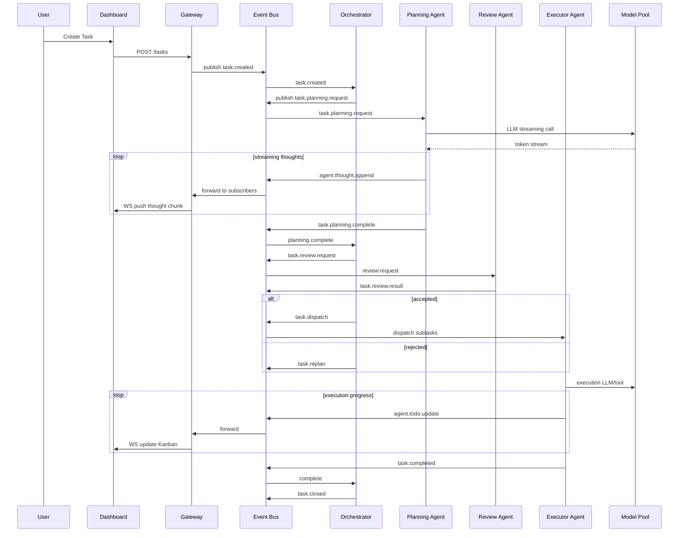

# Edict Agent architecture redesign document

## 1. Design goals
- **Observability**: Dashboard can display each agent’s thoughts and todo changes in real time.
- **Replayable & Auditable**: All events and state changes are persistent and can be traced back.
- **Controllable process**: retains the logic of three provinces and six parts, is event-driven, and supports manual intervention.
- **Real-time and scalable**: low-latency interaction, supports horizontal expansion.
- **Structured tasks and pluggable skills**: Todos and thoughts are structured to facilitate UI rendering and reuse.

## 2. Overall components
1. **API Gateway/Control Plane** (REST + WebSocket)
2. **Orchestrator (scheduling core)**
3. **Event Bus/Stream Layer** (Redis Streams/NATS/Kafka)
4. **Agent Runtime Pool**
5. **Model/LLM Pool**
6. **Task Store/Audit DB** (Postgres + JSONB)
7. **Realtime Dashboard** (WebSocket client)
8. **Observability/Tracing** (Prometheus + Grafana + OpenTelemetry)

## 3. Communication mode
- **Event-Driven**: All inter-agent communication is through Event Bus
- **Topic Examples**: `task.created`, `task.planning`, `task.review.request`, `task.review.result`, `task.dispatch`, `agent.thoughts`, `agent.todo.update`, `task.status`, `heartbeat`
- **Event Structure**:
```json
{
  "event_id": "uuid",
  "trace_id": "task-uuid",
  "timestamp": "2026-03-01T12:00:00Z",
  "topic": "agent.thoughts",
  "event_type": "thought.append",
  "producer": "planning-agent:v1",
  "payload": { ... },
  "meta": { "priority": "normal", "model": "gpt-5-thinking", "version": "1" }
}
```

## 4. Thoughts and Todo JSON Schema
**Thought**:
```json
{
  "thought_id": "uuid",
  "trace_id": "task-uuid",
  "agent": "planning",
  "step": 3,
  "type": "reasoning|query|action_intent|summary",
  "source": "llm|tool|human",
  "content": "text",
  "tokens": 123,
  "confidence": 0.86,
  "sensitive": false,
  "timestamp": "2026-03-01T12:00:01Z"
}
```
**Todo**:
```json
{
  "todo_id": "uuid",
  "trace_id": "task-uuid",
  "parent_id": null,
  "title": "Verify data source X",
  "description": "拉取 X 表的最近 30 天记录，检查缺失值",
  "owner": "exec-dpt-1",
  "assignee_agent": "data-agent",
  "status": "open",
  "priority": "high",
  "estimated_cost": 0.5,
  "created_by": "planner",
  "created_at": "2026-03-01T12:01:00Z",
  "checkpoints": [ {"name":"fetch","status":"done"}, {"name":"validate","status":"pending"} ],
  "metadata": { "requires_human_approval": true }
}
```

## 5. Sequence diagram (Mermaid)


## 6. WebSocket Subscription and Message Example
**Subscribe to news**:
```json
{
  "type": "subscribe",
  "channels": ["task:task-123", "agent:planning-agent", "global"]
}
```
**Thought append (partial)**:
```json
{
  "event": "agent.thought.append",
  "data": {
    "thought_id": "th-1",
    "step": 3,
    "partial": true,
    "type": "reasoning",
    "content": "We should split the task into...",
    "tokens": 15
  }
}
```
**Todo Update**:
```json
{
  "event": "agent.todo.update",
  "data": {
    "todo_id": "todo-1",
    "status": "in_progress",
    "progress": 0.45
  }
}
```

## 7. Manual intervention example
```json
{
  "type": "command",
  "action": "pause_task",
  "trace_id": "task-123"
}
```
Release event:
```json
{
  "event": "task.status",
  "data": {"status": "paused", "reason": "User intervention"}
}
```

## 8. Replay / playback
- Request: `GET /tasks/task-123/events`
- Returns an event array that can be played back one by one on the Dashboard timeline

## 9. Technology stack recommendations
| Layers | Technology |
|----|------|
| Event Bus | Redis Streams |
| API | FastAPI |
| WS | FastAPI WebSocket |
| DB | Postgres |
| Agent Runtime | Python asyncio worker |
| Frontend | React + Zustand |

---
**Remarks**: This document is an architectural design that can be directly downloaded for reference, including event specifications, WebSocket protocols, sequence diagrams and JSON Schema, which can be used to implement real-time agent observable systems.

